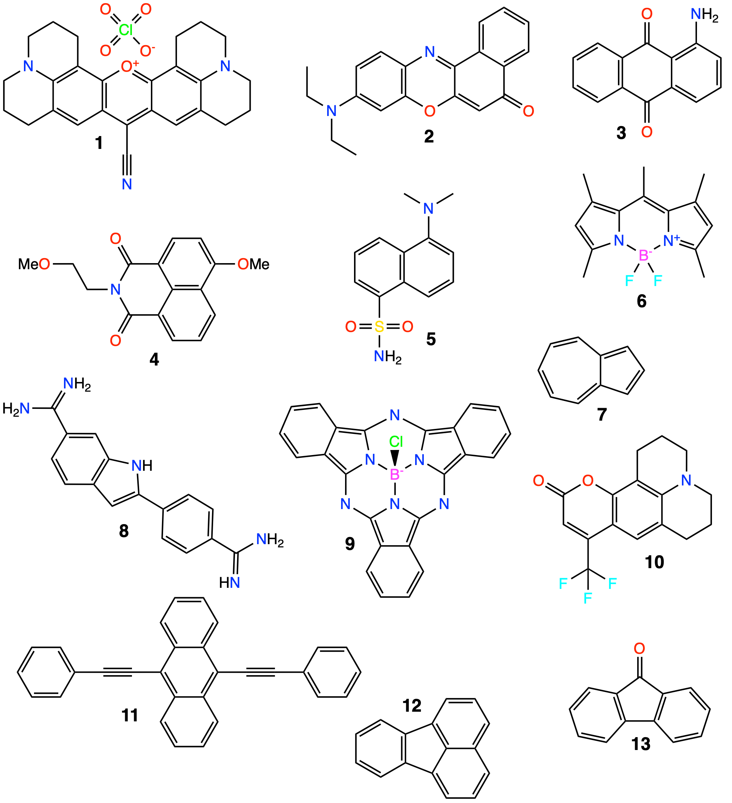
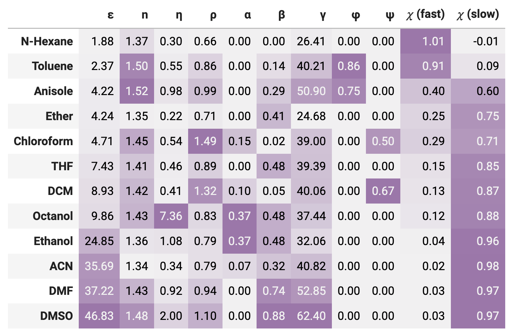
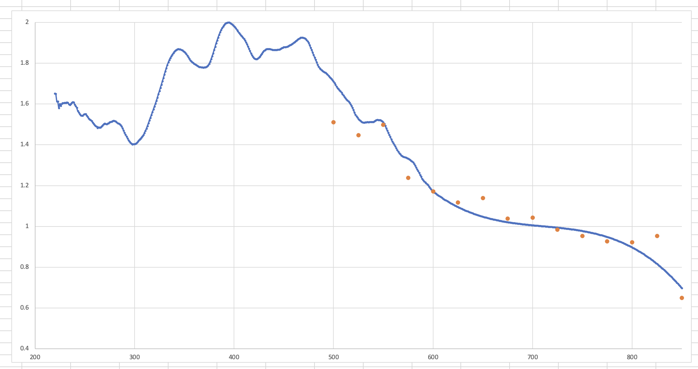

# UV-Vis and Time Resolved Fluorophore dataset for Computational study (UTFC?)

## The Dataset

### Fluorophores



Keys: 
1. r800: Rhodamine 800
2. nr: Nile Red
3. aaq: 1-Aminoanthraquinone
4. nda: *n*-methoxyethyl-4-methoxy-1,8-naphthalimide
5. daa: Dansyl amide
6. bod493: BODIPY 493/503
7. az: Azulene
8. dapi: DAPI
9. bsc: Boron Subphthalocyanine Chloride
10. c153: Coumarin 153 

### Solvents



keys:
* nhex: *n*-hexane
* tol: Toluene
* ans: Anisole
* ether: Ether
* chcl3: Chloroform
* thf: THF
* dcm: DCM
* c8oh: Octanol
* etoh: Ethanol
* acn: ACN
* dmf: DMF
* dmso: DMSO


## Directory structure

```
.
├── README.md
├── abs                                   <- Raw absorbance Data
|   └── <fluorophore>
|       └── <fluorophore>_<solvent>.csv
├── fluor                                 <- Raw fluorescence Data
|   └── <fluorophore>
|       └── <fluorophore>_<solvent>.csv
├── ex                                    <- Raw excitation Data
|   └── <fluorophore>
|       └── <fluorophore>_<solvent>.csv
└── tr                                    <- Raw time resolved Data
    └── <fluorophore>
        ├── <fluorophore>_<solvent>_irf.phd/.txt
        └── <fluorophore>_<solvent>.phd/.txt
```


## Notes on the data

### TCSPC

The TCSPC setup is a bespoke implementation utilising:

* PicoHarp 300 for timing of the photons
* Fianium SC-400-pp white laser for excitation, (with wavelength selection filters)
  * a PicoQuant TDA 200 trigger diode was used for timing of the white laser, with a coverslip used to redirect ~10-12% of the photon flux
* ThorLabs 375nm laser diode head driven by a PicoQuant PDL 800-D for UV excitation
  * The trigger signal for the PicoHarp was taken directly from the PicoQuant. 
* ThorLabs PF10-03-F01 mirrors (250-450 nm) for the UV path
* ThorLabs BB1-EO2 mirrors (400-750 nm) for the Visible path

Stil investigating

* The Micro-channel plate PMT

The time resolved data is stored in a mix of .txt and .phd files. The .phd importer wasn't written until just after data acquisition started, so a few species were still stored via the "copy-paste from PicoHarp into notepad" method.

The newly written .phd file importer is available at [picoharp-phd](https://github.com/adreasnow/picoharp-phd) and is able to read all of the TRF and IRF data within this dataset. (It has to, since it's the code I'm maintaining to process the data!)

### UV-Vis

This data was all recorded on an Agilent Cary 60 UV-Vis spectrophotometer. Validation of the instrument was performed by a registered Agilent technician was within operating standards

### Fluorescence and Excitation

This data was all collected on an Agilent Cary Eclipse fluorescence spectrometer and has been corrected for using the correction curves provided in the corrections folder. Validation of the instrument was performed by a registered Agilent technician was within operating standards

#### Corrections

The corrections provided are `exCorr` for the excitation lamp, `emCorr` for the PMT sensitivity, and `cuvette_trans` which accounts for the small difference in transmission for shorter wavelengths. They're applied as such...

the `exCorr.csv` file generated by the Cary Eclipse needs to be divided by `emCorr` in order to obtain the multiplier used in the equations below.

For emission spectra:

```python
for x, y in zip(xRound, yIn):
  yCorr += [y * emCorr[*int*(x)] * exCorr[enLambda] * cuvette_trans[*int*(x)] * cuvette_trans[enLambda]]
```

For excitation spectra

```python
for x, y in zip(xRound, yIn):
    yCorr += [y * exCorr[int(x)] * emCorr[enLambda] * cuvette_trans[int(x)] * cuvette_trans[enLambda]]
```

All of this has been implemented in [specCorr.py](https://github.com/adreasnow/es-and-monarch-handler/blob/main/specCorr.py) in my working repository for this study.

Solvent baseline spectra have also been collected for each emission and excitation spectrum.

#### Excitation Corrections beyond 600nm

For corrections beyond 600nm, a ThorLabs PM100D power meter was used to sample the power delivered at 25nm increments from 500nm to 850nm. The 500-600nm region wa used to scale the power meter readings to match the existing excitation corrections, and a third order polynomial was fit to the remaining data points. This function was used to generate an approximation for the remaining excitation corrections up to 850nm.



These values are not considered analytical, however excitation spectra are included in this dataset to verify the correlation between absorbance and emission, and are provided in `corrections/exCorr-600nm+.csv`.
